# VOI Desktop Application

Java Swing desktop application for managing Vehicles of Interest.

## Features
- Dashboard screen
- Vehicles of Interest management
- Reasons for Interest management
- Makes and Models management
- Add / Edit / Delete functionality
- Apache Derby database integration

## Technologies
- Java
- Java Swing
- JDBC
- Apache Derby
- NetBeans

## How to Run
1. Clone this repository.
2. Open the project in Apache NetBeans.
3. Make sure the Derby libraries are available in the project:
   - `derby.jar`
   - `derbyclient.jar`
4. Check the database path in `VehiclesOfInterestController.java`.
5. Run the project from NetBeans.

## Screenshots & Application Walkthrough

---

### Dashboard
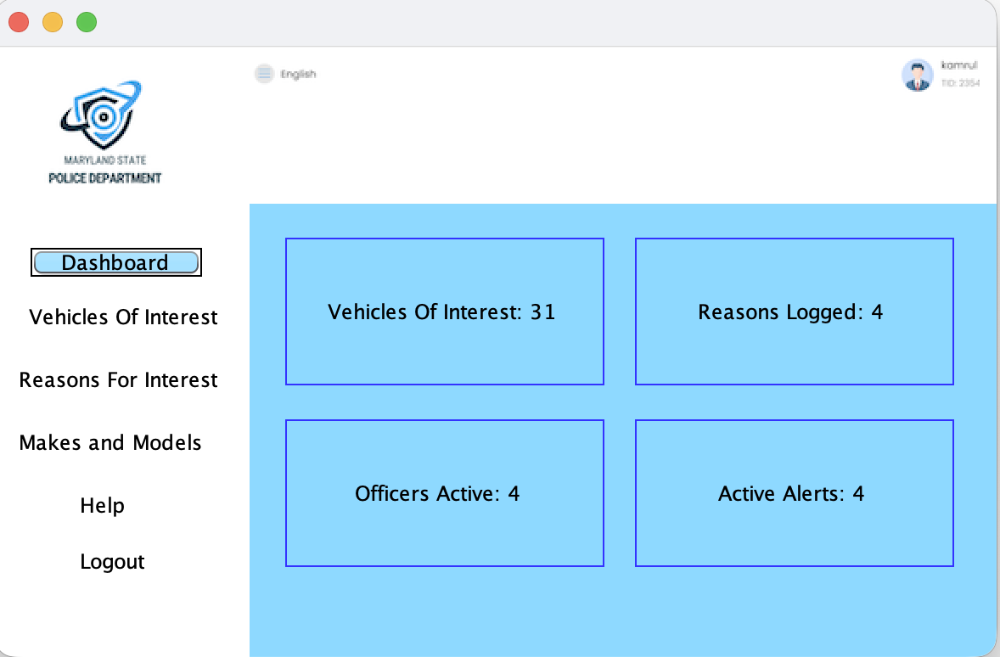  
Main entry point of the application showing system overview and navigation.

---

### Vehicles of Interest Workflow

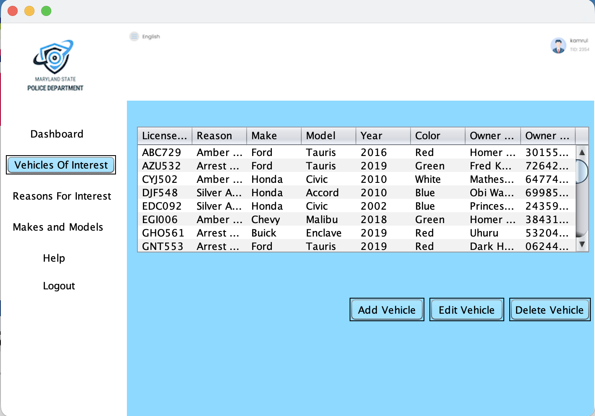  
Displays all vehicles of interest stored in the database.

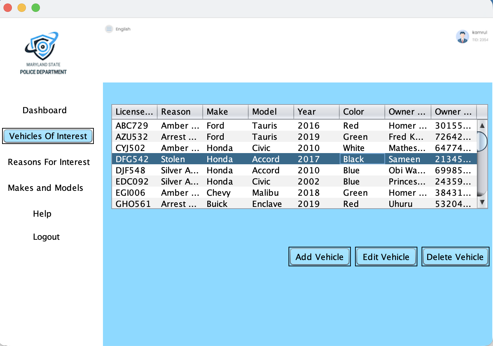  
User enters a new vehicle record. Pop up prompts the user to enter License Plate for the new vehicle record. Similarly, user is prompted to enter information into all other fields for the record. 

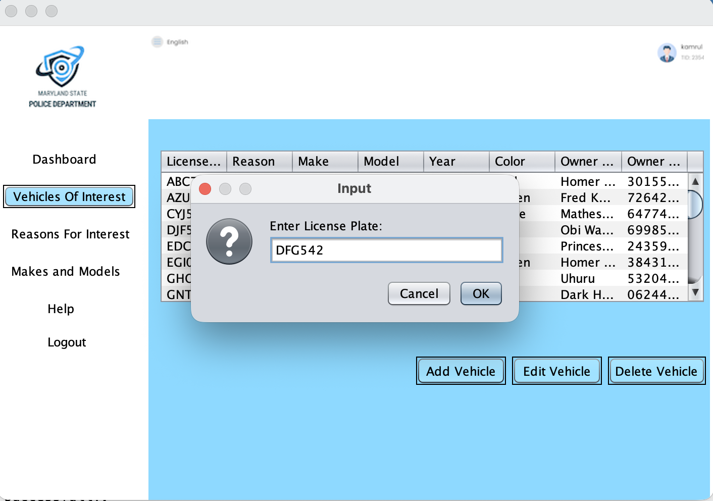  
Vehicle successfully added to the system.

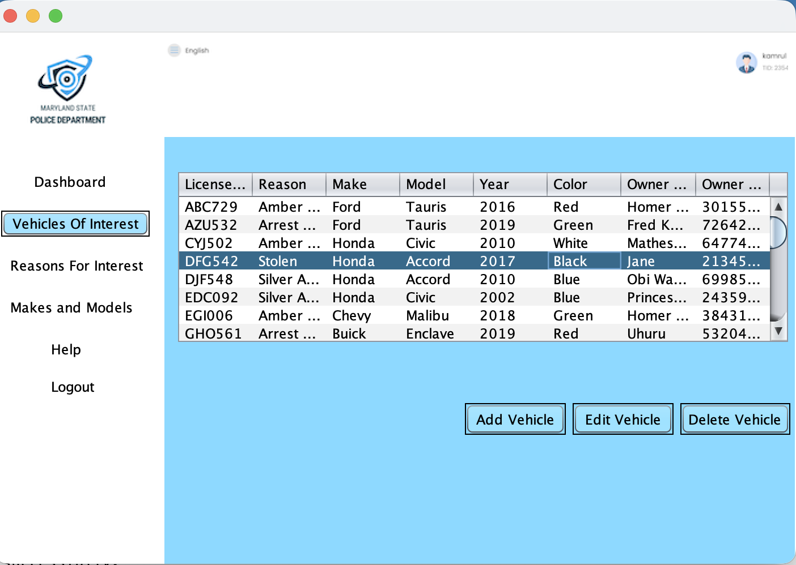  
Existing vehicle record updated. User selects a vehicle and clicks on 'Edit Vehicle'. User is prompted to edit vehicle information similar to the prompts to add a new vehicle. 
Owner name has been changed.

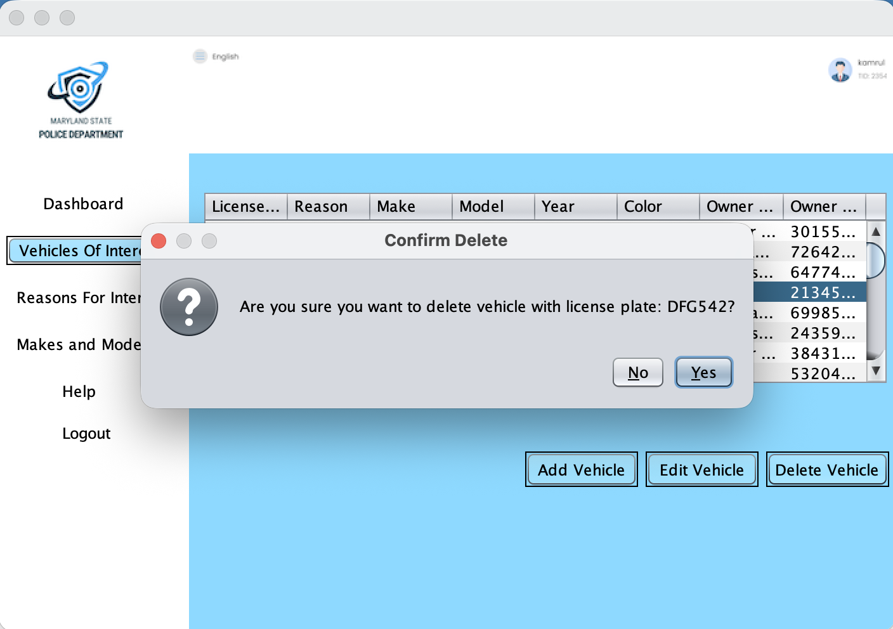  
Vehicle deletion confirmation and removal.

---

### Reasons for Interest

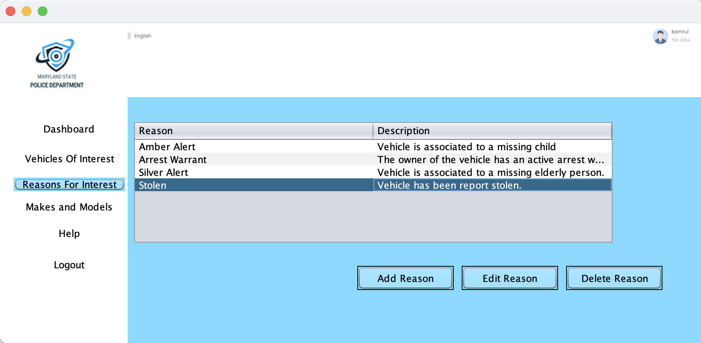  
Manage reasons associated with flagged vehicles.

---

### Makes and Models Workflow

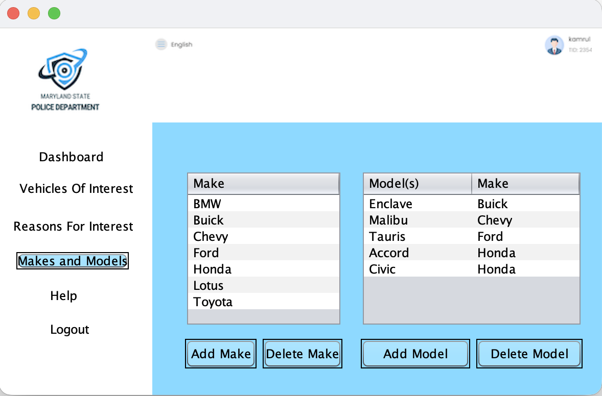  
Displays available vehicle makes and models.

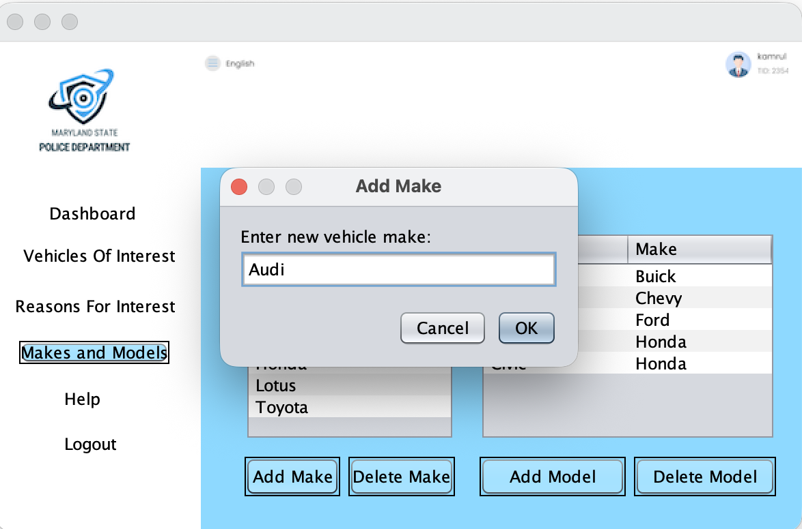  
User adds a new vehicle make.

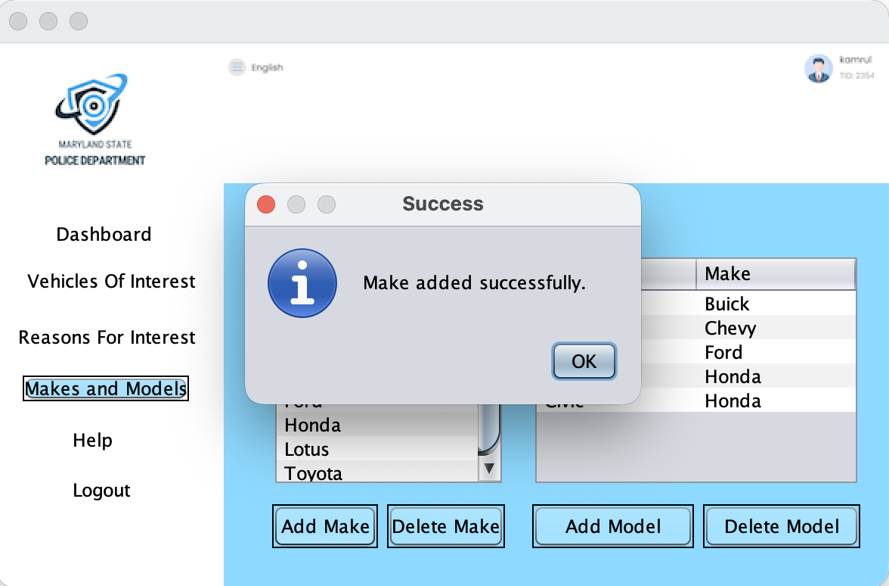  
Confirmation of successful make addition.

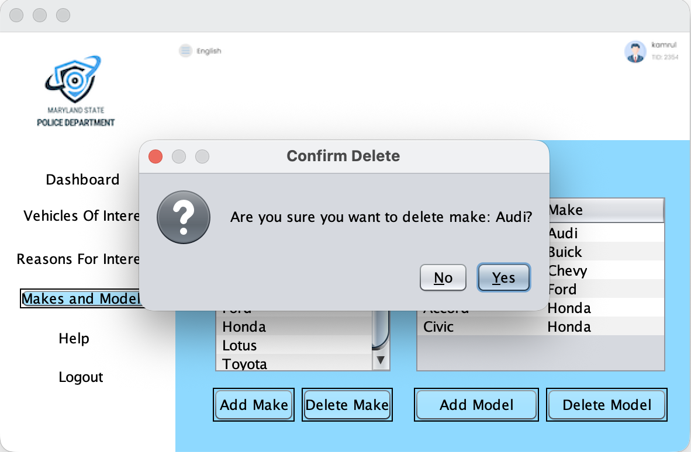  
Confirmation before deleting a make.

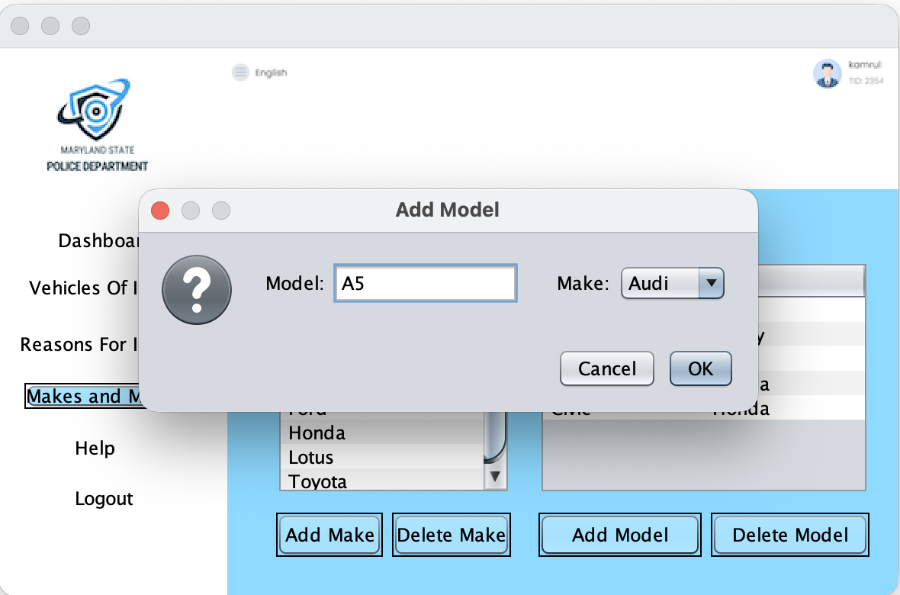  
User adds a new vehicle model.

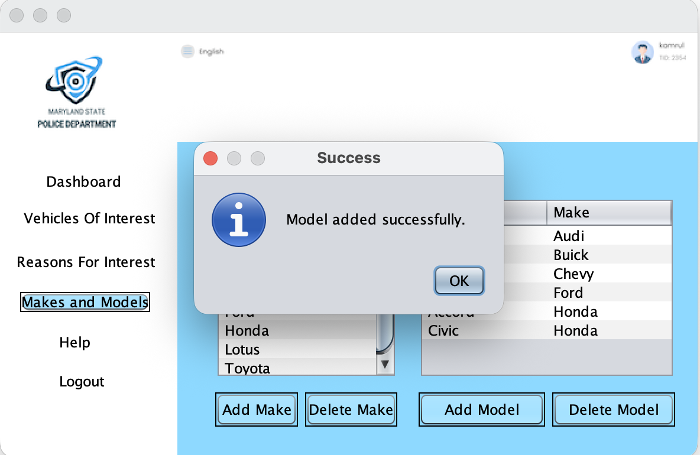  
Model successfully added.

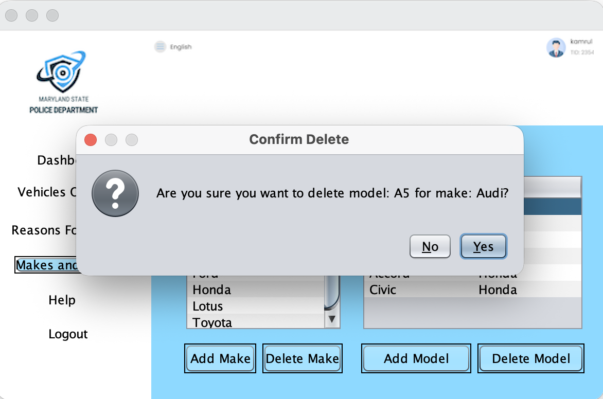  
Confirmation before deleting a model.

---

### Additional UI

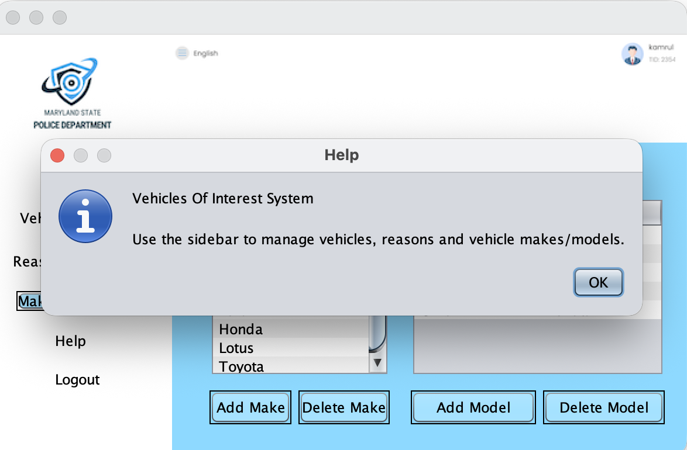  
Placeholder Help functionality for future expansion.

## Notes
This application uses a local Apache Derby database.  
If running on another machine, update the database path in `VehiclesOfInterestController.java` to match your local setup.

## Author
Sameen Shahbaz
